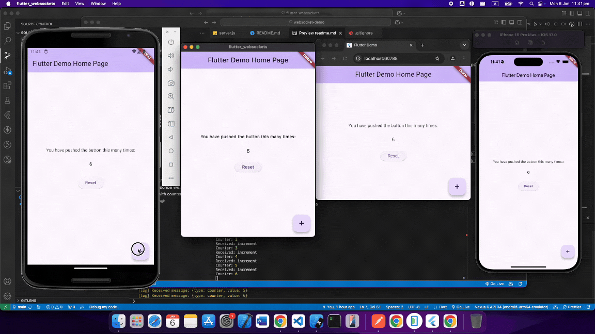

# flutter_websockets

This project demonstrates the use of WebSockets in a Flutter application. It includes examples of connecting to a WebSocket server, sending and receiving messages, and handling different WebSocket events. The project aims to provide a clear and concise implementation to help developers integrate WebSocket functionality into their own Flutter applications.



## WebSocket Server
You can find the Websocket server for this project [here](https://github.com/0xharkirat/websocket-demo)

## Getting Started

This project follows the [Flutter Cookbook: Communicate with WebSockets](https://docs.flutter.dev/cookbook/networking/web-sockets).

## Platform Specific Configuration
For this project, it is already configured. However, for your own Flutter client in the future, remember to configure it as follows.

### macOS

To enable network client access in your macOS application, add the following key to both `macos/Runner/Release.entitlements` and `macos/Runner/Debug.entitlements` files:

```
<key>com.apple.security.network.client</key>
<true/>
```

### Android

For Android, ensure you have the necessary permissions in your `AndroidManifest.xml` file:

```xml
<manifest ...>

    <uses-permission android:name="android.permission.INTERNET"/>
    <application ...>
    ...

</manifest>
```

